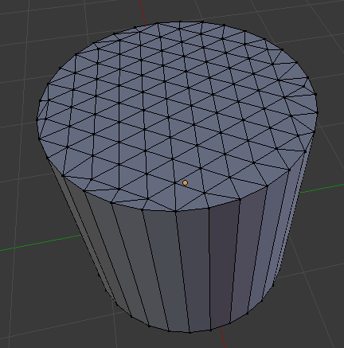
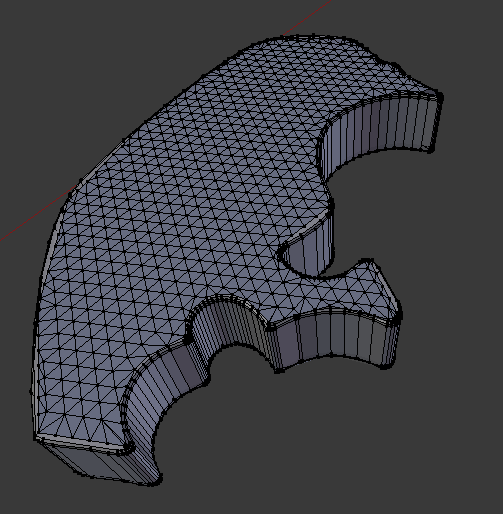

# Blender addons

Just some blender addons that I've been developing.

## Triangle fill

This add-on fills the selected face with small regular triangles.
This is useful to make the face pliable for e.g. sculpting operations.
Think of it as a grid fill for irregular faces, or as a remesh for only selected faces.

### Usage

1. File -> User Preferences -> Add-ons -> Install from file. Then add a checkmark to "Triangle fill".

2. Select your mesh, tab into edit mode and select "face select mode" from toolbar at bottom.
Select one face of the mesh.

3. Press spacebar and type "Triangle Fill" or choose "Triangle Fill" from Blender "Face" operators menu at the top of the viewport.

4. You can adjust the size of the triangles in the sidebar.

### Example results

### Known bugs

* Kind of slow
* Sometimes leaves holes in the result
* Can only operate on one face at a time

